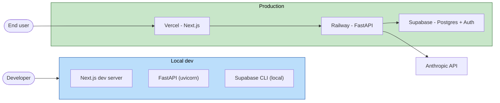

# U0 Foundation — Deployment Architecture

## Topology

### Mermaid


### Text alternative
```
Local dev:   Next.js dev server + FastAPI (uvicorn) + Supabase CLI (local Postgres)
Production:  End user -> Vercel (Next.js) -> Railway (FastAPI) -> Supabase (Postgres+Auth)
                                                        FastAPI -> Anthropic API
```

## Environments (Q1 = A)
| Environment | Frontend | Backend | Database | Purpose |
|---|---|---|---|---|
| **Local** | Next.js dev | uvicorn | Supabase CLI (`supabase start`) | development + `supabase db reset` testing |
| **Preview** | Vercel preview per PR | (points at prod backend or a preview) | prod Supabase (read-mostly review) | PR review |
| **Production** | Vercel prod | Railway | Supabase project | live |

No dedicated persistent staging in the MVP (deferrable). Vercel preview deployments cover PR validation.

## Promotion flow
```
feature/uN-* branch
   -> open PR  -> CI gates (tests + PBT + type-check + lint + dep-scan + SBOM) + Vercel preview
   -> squash-merge into main (branch-protected, green CI required)
   -> main deploys: Vercel (web) + Railway (backend); Supabase migrations applied via CLI (supabase db push)
```

## Data & migrations
- Schema changes are SQL-first migration files in `memorise-supabase/migrations/`, created with
  `supabase migration new`, tested locally with `supabase db reset`, applied with `supabase db push`.
- No ad-hoc changes to the live database.

## Scaling / DR posture (MVP)
- Single Railway backend instance; Supabase/Vercel free tiers at low usage.
- No HA/DR targets (Resiliency Baseline not enabled). In-process rate limiting assumes a single
  backend instance; a shared store is the documented upgrade path if horizontal scaling is added.
