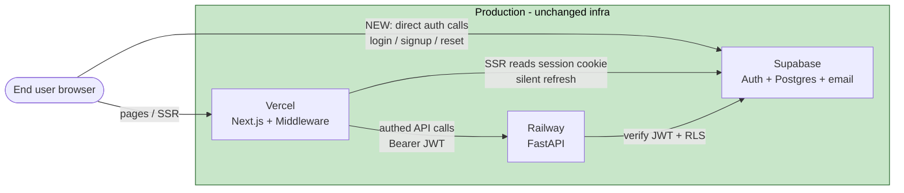

# U1 — Accounts & Auth — Deployment Architecture

U1 changes **no topology** — it reuses U0's deployment architecture
(`construction/u0-foundation/infrastructure-design/deployment-architecture.md`). What U1 adds is a
**new runtime data path**: the browser now talks to Supabase Auth **directly** (frontend-direct auth),
and Vercel Middleware refreshes the session cookie on each request. No new boxes, one new edge.

## Topology (U1 view — new/changed paths highlighted)

### Mermaid


### Text alternative
```
Unchanged infra: Vercel (Next.js + Middleware), Railway (FastAPI), Supabase (Auth+Postgres+email).
Runtime paths in U1:
  Browser --> Vercel                (pages / SSR)
  Browser --> Supabase   [NEW]      (direct auth: login/signup/reset)
  Vercel  --> Supabase              (SSR reads session cookie; middleware silent refresh)
  Vercel  --> Railway               (authenticated API calls carry the Supabase JWT)
  Railway --> Supabase              (verify JWT + enforce RLS)
Session tokens live in httpOnly+Secure+SameSite=Lax cookies (set by @supabase/ssr).
```

## Environments (inherited from U0 — no change)
Local (Supabase CLI `supabase start`) · Vercel preview per PR · single Production. No dedicated staging.
Preview deployments point at the production Supabase project for auth (read-mostly review), same as U0.

## Auth configuration in the promotion flow (Q1 = A)
Supabase Auth settings live in `memorise-supabase/config.toml` (version-controlled) and are applied
by the Supabase CLI as part of the existing deploy step — alongside SQL migrations, not as a separate
manual process:

```
feature/u1-* branch
   -> open PR -> CI gates (tests + PBT + type-check + lint + dep-scan + SBOM) + Vercel preview
   -> squash-merge into main (branch-protected, green CI required)
   -> main deploys: Vercel (web, incl. middleware) + Railway (backend, incl. CSP connect-src env)
   -> Supabase CLI applies migrations AND auth config.toml (same values reproduced local -> prod)
```

- The CSP `connect-src` Supabase origin is an **env var** (`SUPABASE_URL` on Railway; `NEXT_PUBLIC_SUPABASE_URL` on Vercel) — no code change per environment.
- Settings `config.toml` cannot express are set once in the dashboard and recorded in `memorise-supabase/README` (documented fallback, not the default path).

## Scaling / DR posture (unchanged from U0)
Auth is Supabase-managed (scales independently of our compute). Single Railway backend instance;
in-process SlowAPI rate limiting still assumes a single instance (documented upgrade path unchanged).
No HA/DR targets — Resiliency Baseline OFF. Brute-force protection and password-policy enforcement are
delegated to Supabase Auth, so no U1-owned infrastructure carries that load.
