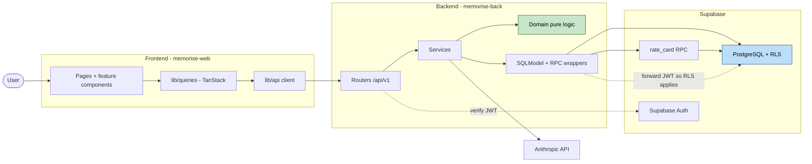

# MemoRise — Component Dependencies & Data Flow

Pattern A: the frontend talks **only** to FastAPI; FastAPI is the single gateway to Supabase.

---

## Dependency matrix (backend)

| Component ↓ depends on → | Domain | DB/RPC | Anthropic | Metering | Gamification |
|---|:--:|:--:|:--:|:--:|:--:|
| `DeckService` | | ● | | | |
| `CardService` | | ● | | | |
| `SchedulerService` | ● | ● | | ● | ● |
| `GamificationService` | ● | ● | | | — |
| `AICardService` | | | ● | ● | |
| `MeteringService` | | ● | | | |
| `UserService` | | ● | | | |

● = direct dependency. Domain module depends on **nothing** (pure) — it is a leaf.

---

## Data flow — request path

### Mermaid



### Text alternative (always included)

```
User
 -> Frontend: pages/components -> TanStack queries -> lib/api client
 -> Backend: Routers (/api/v1, verify JWT with Supabase Auth)
      -> Services
           -> Domain (pure SM-2 / gamification math; no I/O)
           -> Data access (SQLModel + RPC wrappers)
                -> PostgreSQL (RLS; JWT forwarded so RLS applies)
                -> rate_card RPC (atomic: card + profile + review_log)
           -> Anthropic API (AICardService only)
```

---

## Communication patterns
- **Frontend ↔ Backend:** REST/JSON over HTTPS, `/api/v1/*`, Pydantic-validated. TanStack Query
  caches reads and does optimistic updates on rating submit.
- **Backend ↔ Supabase:** SQLModel for CRUD; the `rate_card` RPC for the one atomic multi-write;
  JWT forwarded so RLS applies at the DB (defense in depth).
- **Backend ↔ Anthropic:** only `AICardService`; user text passed as data, never as instructions.

## Layering rules (enforced downstream)
1. Routers never contain business logic (call services).
2. Services never embed pure math (call `domain/`).
3. Domain has zero I/O (fully unit- and property-testable).
4. Only `AICardService` touches Anthropic; only data-access touches Supabase.
