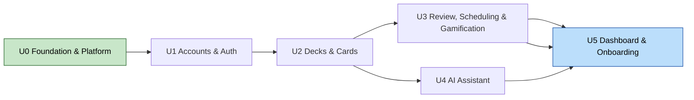

# MemoRise — Unit Dependency Matrix & Build Order

## Dependency matrix

| Unit ↓ depends on → | U0 | U1 | U2 | U3 | U4 |
|---|:--:|:--:|:--:|:--:|:--:|
| **U0 Foundation** | — | | | | |
| **U1 Accounts & Auth** | ● | — | | | |
| **U2 Decks & Cards** | ● | ● | — | | |
| **U3 Review/Sched/Gamif** | ● | ● | ● | — | |
| **U4 AI Assistant** | ● | ● | ● | | — |
| **U5 Dashboard & Onboarding** | ● | ● | ● | ● | ● |

● = requires the unit to exist first. U0 is a hard prerequisite for everything.

## Build order

### Mermaid


### Text alternative
```
U0 Foundation  (prerequisite for all)
  -> U1 Accounts & Auth
       -> U2 Decks & Cards
            -> U3 Review, Scheduling & Gamification ---> U5 Dashboard & Onboarding
            -> U4 AI Assistant --------------------------> U5 Dashboard & Onboarding
```

## Notes
- **Critical path:** U0 → U1 → U2 → U3 → U5.
- **U4 (AI)** only needs U2; it can be built any time after Decks & Cards. Linear order (after U3)
  keeps the core review loop validated first.
- **Integration coupling:** the `rate_card` RPC (U3) is the one atomic multi-table write; keeping
  Review + Gamification in U3 avoids a cross-unit atomic dependency.
- **Shared foundations from U0** (auth guard, logging, error handler, RLS pattern, CI) are reused by
  every later unit — not re-implemented.
