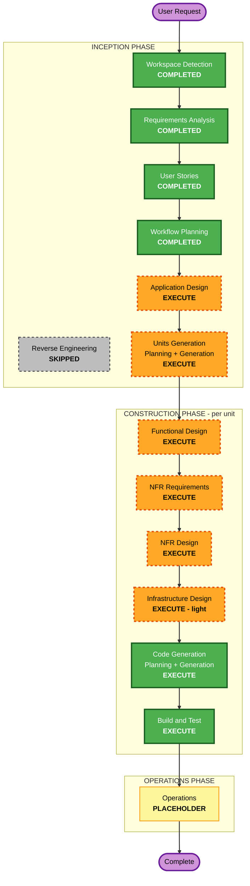

# Execution Plan — MemoRise MVP

**Stage:** INCEPTION → Workflow Planning · **Generated:** 2026-07-05 · **Status:** Awaiting approval
**Project type:** Greenfield · **Enabled extensions:** Security Baseline, Property-Based Testing (full)

---

## Detailed Analysis Summary

### Change Impact Assessment
- **User-facing changes**: **Yes** — the entire MVP is new user-facing functionality (auth, decks, cards, review loop, gamification, AI assistant, dashboard).
- **Structural changes**: **Yes** — a new three-layer system is being built from scratch (Next.js → FastAPI → Supabase).
- **Data model changes**: **Yes** — new schema for users' decks, cards, SM-2 scheduling state, XP/level/streak, AI usage metering, and metric events; RLS on every table.
- **API changes**: **Yes** — a full new `/api/v1` REST surface (decks, cards, reviews, AI).
- **NFR impact**: **Yes** — security (enabled extension), performance of the review loop, per-user AI metering/cost, and property-based testing all apply.

### Risk Assessment
- **Risk Level**: **Medium** — system-wide greenfield build with AI integration and security-sensitive per-user data, but on managed platforms (Vercel/Railway/Supabase) with no existing users or data to migrate.
- **Rollback Complexity**: **Easy** — no production users yet; changes are additive.
- **Testing Complexity**: **Moderate** — pure logic (SM-2, XP/streak) plus AI happy/failure paths; addressed by the enabled PBT + example-based strategy.

### Complexity → Depth
- Overall complexity is **Complex**; most stages run at **Standard–Comprehensive** depth.
- **Infrastructure Design** runs at **light** depth: the platforms are already chosen and managed (tech-environment §3), so this stage maps services and env/deploy config rather than designing bespoke cloud infrastructure. (Resiliency Baseline is not enabled.)

---

## Workflow Visualization

### Mermaid Diagram



### Text Alternative (always included)

```
🔵 INCEPTION PHASE
- Workspace Detection ....... COMPLETED
- Reverse Engineering ....... SKIPPED (greenfield)
- Requirements Analysis ..... COMPLETED
- User Stories .............. COMPLETED
- Workflow Planning ......... COMPLETED (this stage)
- Application Design ........ EXECUTE
- Units Generation ......... EXECUTE

🟢 CONSTRUCTION PHASE (runs per unit, in a loop)
- Functional Design ........ EXECUTE
- NFR Requirements ......... EXECUTE
- NFR Design ............... EXECUTE
- Infrastructure Design .... EXECUTE (light)
- Code Generation .......... EXECUTE (always)
- Build and Test ........... EXECUTE (always, after all units)

🟡 OPERATIONS PHASE
- Operations ............... PLACEHOLDER (out of scope for this build)
```

---

## Phases to Execute

### 🔵 INCEPTION PHASE
- [x] Workspace Detection — COMPLETED
- [x] Reverse Engineering — SKIPPED (greenfield; no existing code)
- [x] Requirements Analysis — COMPLETED (approved 2026-07-05)
- [x] User Stories — COMPLETED (approved 2026-07-05)
- [x] Workflow Planning — IN PROGRESS (this document)
- [ ] **Application Design — EXECUTE**
  - **Rationale**: New system with multiple services and a required service layer. Component methods and business rules (SM-2 scheduling, XP/level/streak, AI orchestration, atomic `rate_card`) need definition, plus component dependencies across the three layers.
- [ ] **Units Generation — EXECUTE**
  - **Rationale**: The system needs decomposition into buildable units (auth, decks/cards, review & scheduling, gamification, AI assistant, dashboard/frontend, data/RLS, CI). Multiple modules with new schemas and endpoints justify a structured breakdown before construction.

### 🟢 CONSTRUCTION PHASE (per unit)
- [ ] **Functional Design — EXECUTE**
  - **Rationale**: New data models/schemas and complex business logic; also required to satisfy PBT-01 (identify testable properties per unit) for the enabled PBT extension.
- [ ] **NFR Requirements — EXECUTE**
  - **Rationale**: Security (enabled), review-loop performance, and per-user AI metering/cost apply. Also selects the PBT frameworks (Hypothesis + fast-check) per PBT-09.
- [ ] **NFR Design — EXECUTE**
  - **Rationale**: NFR Requirements will run, so the security controls (SEC-*) and testing patterns must be designed into each unit.
- [ ] **Infrastructure Design — EXECUTE (light)**
  - **Rationale**: Deployment must be specified (Vercel frontend, Railway backend, Supabase DB/Auth) with env/secret configuration and CI. Kept lightweight since platforms are managed and pre-chosen; Resiliency Baseline is not enabled.
- [ ] **Code Generation — EXECUTE (always)**
  - **Rationale**: Implementation of each unit, with example-based + property-based tests.
- [ ] **Build and Test — EXECUTE (always)**
  - **Rationale**: Build all units; run unit/integration/E2E + PBT with seed logging and CI gating.

### 🟡 OPERATIONS PHASE
- [ ] Operations — PLACEHOLDER
  - **Rationale**: Deployment/monitoring workflows are a future expansion; not part of this build.

---

## Estimated Scope
- **Conditional stages to execute**: 6 (Application Design, Units Generation, Functional Design, NFR Requirements, NFR Design, Infrastructure Design) + the two always-on Construction stages (Code Generation, Build and Test).
- **Stages skipped**: 1 (Reverse Engineering — greenfield).
- **Construction is per-unit**: the design + code stages repeat for each unit defined in Units Generation; Build and Test runs once after all units.
- **Timeline**: driven interactively stage-by-stage (each stage has its own approval gate); no fixed calendar estimate.

## Success Criteria
- **Primary Goal**: A working MemoRise MVP matching the approved requirements and 29 user stories.
- **Key Deliverables**: Auth, deck/card CRUD, SM-2 review loop, XP/level/streak gamification, AI card generation (Sonnet), dashboard, per-user metering + metric logging, all on the Next.js → FastAPI → Supabase stack.
- **Quality Gates**: Security Baseline compliance at each stage; PBT + example-based tests; CI green (tests + type-check + lint + dependency scan) required to merge.
